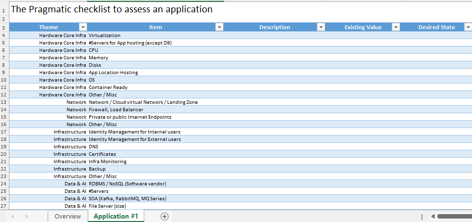

# The Pragmatic checklist to assess an application

When you plan to modernize an application, there are several questions to ask yourself/your customer to apprehend when the modernization would bring value.

This is a draft of potential questions you should take into consideration when doing an assessment.

## The assessment

Available in the following formats:

- [Markdown](dest/Application%20Assessment.md)
- [Excel](dest/Application%20Assessment.xlsx)
- [CSV](dest/Application%20Assessment.csv)

## How to contribute

You just need to [edit the source file](src/Application%20Assessment.md)

## How to locally generate files

If you want to see the final result locally and generate CSV & Excel files, follow this guide

### Install

1. Make sure you are using the Python version specified in the `.python-version` file (or use [pyenv](https://github.com/pyenv/pyenv) for the automation)
2. Run `make install`

### Build

1. Run `make build`

### Test the Python code

1. Run `make py-test`

## Content

Here are the categories to assess

- Global Information
- Business Concerns
- Hardware Core Infra
- Network
- Infrastructure
- Data & AI
- Software Specifications
- Software Services
- Metrics
- Project Management

